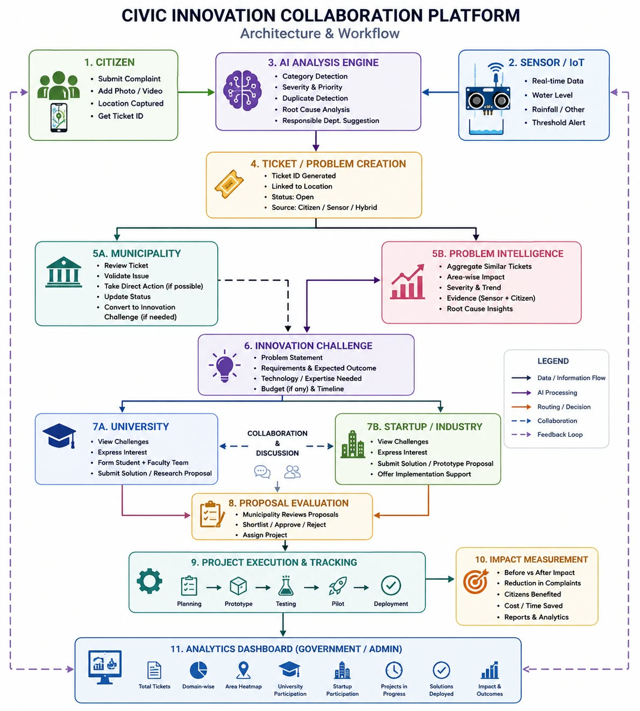

# 🌍 Nagrik_Nova

## AI-Powered Platform for Societal Challenge Discovery & Collaborative Problem Solving

> A digital platform that crowdsources real societal challenges and connects them with universities and industry partners to collaboratively develop meaningful solutions.

---

## 📌 Smart India Hackathon 2026

**Problem Statement ID:** SIH26043  
**Organization:** Government of Jharkhand  
**Category:** Software  
**Theme:** Disaster Management  

### Problem Statement

> **A digital platform to crowdsource societal challenges and facilitate collaborative problem solving through universities and industry partnerships.**

---

## 💡 Problem
Societal challenges exist across communities, cities, and rural areas, but many of them never reach the right people or organizations capable of addressing them. Communities may identify these challenges, while universities have students, researchers, and technical expertise, and industries possess domain knowledge, resources, and practical experience.

 However, there is often no common platform where these stakeholders can discover a real challenge and come together to work on it. As a result, societal challenges and the people or organizations capable of solving them remain disconnected.

---

## 🚀 Our Solution

**Nagrik_Nova** acts as a bridge between:

- 👥 Citizens and communities who identify societal challenges
- 🤝 NGOs and organizations working on ground-level problems
- 🏫 Universities and students looking for meaningful real-world challenges
- 🏢 Industries that can provide domain expertise, mentorship, technology, or resources

Users can submit a societal challenge on the platform with relevant details such as the problem description, category, location, affected community, and supporting evidence.

The platform then makes these challenges available for discovery and collaboration.

```text
Societal Challenge
        ↓
Challenge Submitted
        ↓
Review & Structuring
        ↓
Published on Platform
        ↓
Universities & Industries Discover It
        ↓
Interested Partners Join
        ↓
Collaborative Problem Solving
        ↓
Solution / Prototype Development
```
---

## ✨ Key Features

## 📝 Challenge Crowdsourcing

Citizens, communities, NGOs, and organizations can submit real societal challenges.

Each challenge can include:

- Problem description
- Category
- Location
- Affected community
- Images or supporting documents
- Expected impact

---
## 🔍 Challenge Discovery

Universities and industry partners can explore challenges based on:

- Domain
- Category
- Location
- Required area of expertise
- Social impact

This helps organizations discover real problems that align with their capabilities and interests.

---

## 🤝 Collaborative Problem Solving

When a university or industry is interested in a challenge, they can join the challenge and collaborate with other participants.

The platform can provide a dedicated space for:

- Challenge details
- Discussion
- Solution proposals
- Task and progress tracking
- Document and resource sharing
- Prototype updates

---

## 🏫🏢 University & Industry Profiles

Universities and industries can create profiles showcasing:

- Areas of expertise
- Departments or domains
- Available resources
- Previous projects
- Areas of interest

This makes it easier for challenge owners and other collaborators to identify suitable partners.

---

## 🤖 AI-Assisted Challenge Understanding

AI can assist in understanding submitted challenges by:

- Categorizing problem descriptions
- Generating a clear challenge summary
- Identifying related or similar challenges
- Suggesting relevant domains or areas of   expertise

The goal is to make raw problem submissions easier for universities and industries to understand and act upon.

---

## 🎯 Platform Workflow


---

## 🌟 Vision

- ChallengeBridge aims to ensure that real societal challenges do not remain isolated problems.

- By creating a common digital ecosystem, the platform enables communities to bring forward challenges and allows universities and industries to collaborate on developing practical and meaningful solutions.

- From identifying a problem to bringing together the people capable of solving it.

---

## 🛠️ Proposed Tech Stack
- Frontend: React.js + Tailwind CSS
- Backend: Node.js + Express.js
- Database: MongoDB
- AI Features: NLP / LLM-based challenge analysis
- Authentication: JWT & Role-Based Access Control

---

## 👥 Users

| User / Role | Responsibilities |
|-------------|------------------|
| 👤 Citizen / Community | Submit societal challenges |
| 🤝 NGO / Organization | Submit, validate, and support challenges |
| 🏫 University | Discover challenges and contribute technical expertise, research, and student participation |
| 🏢 Industry | Provide domain expertise, resources, mentorship, and practical support |
| 🛡️ Admin | Review challenges, verify organizations, and manage platform activities |